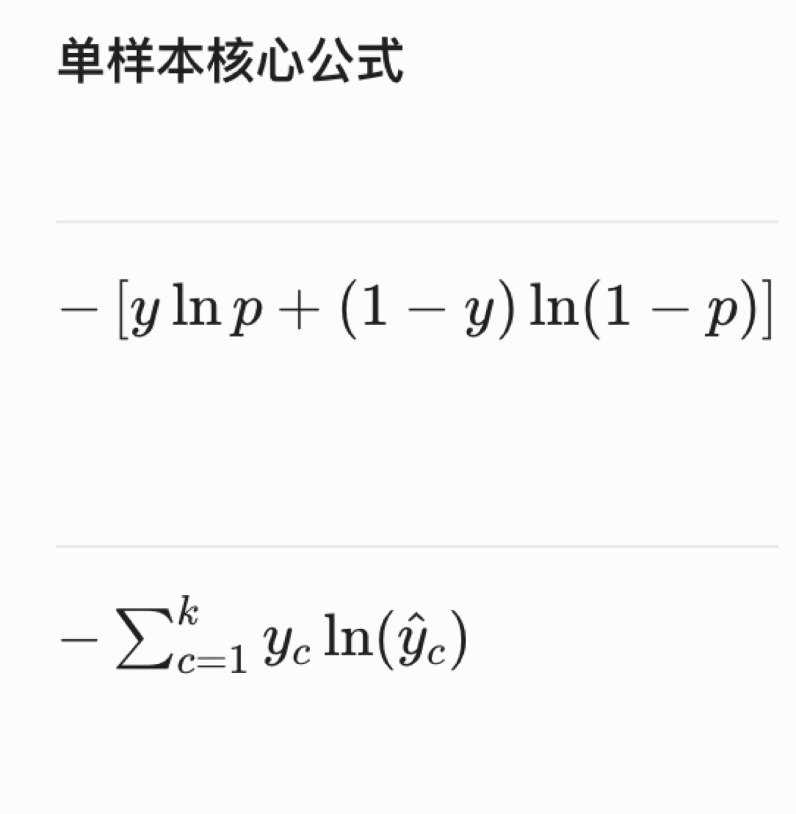
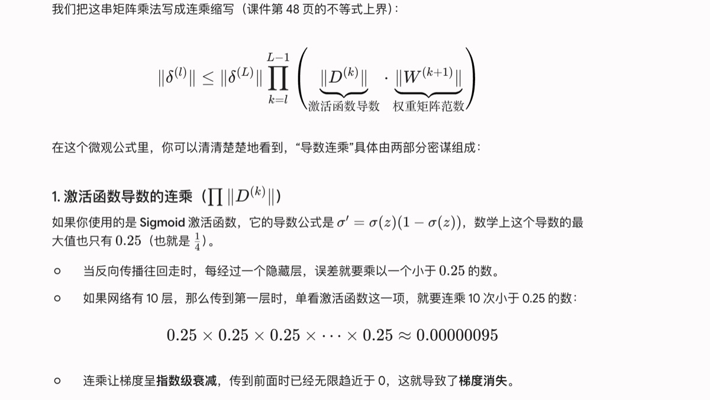
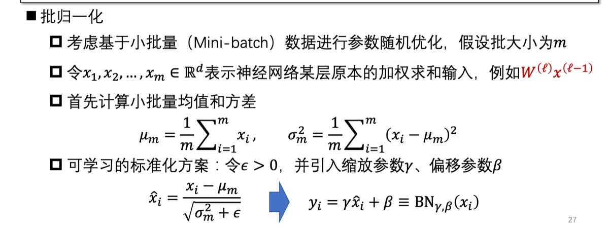
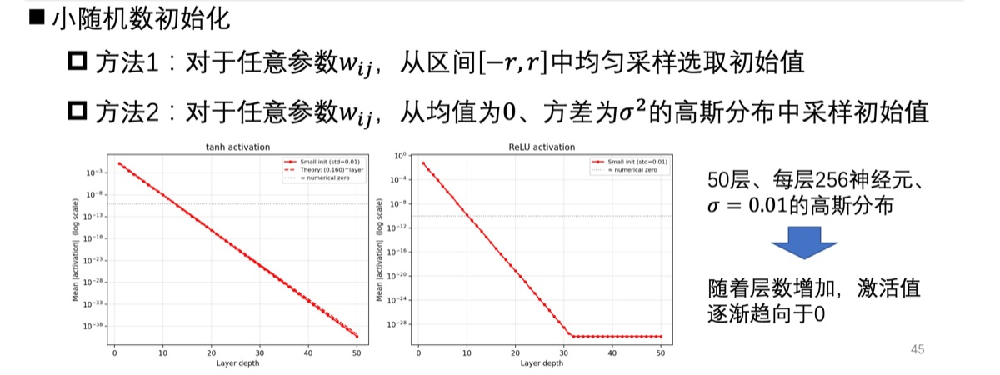

# 04 · 神经网络基础

## 神经元模型

### 单层神经网络
目标：最小化预测错误的样本集合。若预测错，则 $y(wx + b) < 0$。

> 无法解决非线性问题。

### 多层神经网络（MLP）

每一层计算：上一层的输出 $\times$ 权重矩阵 → 激活函数。

> **关键**：激活函数不可省略。无激活函数时，多层在数学上坍塌为单层线性模型。

---

## 主流激活函数

| 激活函数 | 公式 | 特点 |
|----------|------|------|
| Sigmoid | $\frac{1}{1+e^{-z}}$ | 梯度消失 |
| Tanh | $\frac{e^z - e^{-z}}{e^z + e^{-z}}$ | 零中心 |
| ReLU | $\max(0, z)$ | 计算简单，单侧抑制 |
| Leaky ReLU | $\max(\alpha z, z)$ | 解决 ReLU 死亡问题 |

---

## 通用逼近定理

> 只要激活函数具有 Sigmoid 型的非线性连续性质，哪怕只有一个隐藏层的多层感知机，就能以任意精度逼近任意连续函数。

**提升深度可以减少参数量。**

---

## 输出层设计

| 任务类型 | 激活函数 | 损失函数 |
|----------|----------|----------|
| 多变量回归 | 恒等变换 $\sigma(z) = z$ | MSE |
| 多分类 | Softmax | 交叉熵损失（Cross-entropy Loss） |

> 多分类中，直接预测离散标签难以求导，输出层必须挂 Softmax 归一化为后验概率。结合最大对数似然估计推导出交叉熵损失。

---

## 反向传播

1. 先求出**误差项**
2. 用误差项 $\times$ 上一层输出 → 该层梯度
3. 结合步长更新参数

### 对称权重问题

> 同一层神经元参数初始化为相同值 → 前向传播与反向梯度完全相同 → 等价于该层只有一个神经元。

因此需要**随机/差异化初始化**（如 Xavier、He 初始化）。

---

## 数据增强

通过对原始样本进行旋转、翻转、裁剪、加噪声等变换，构造更多训练样本，旨在扩大数据分布、提升泛化能力。

## 归一化

批归一化（Batch Normalization）：加速训练，缓解梯度问题。

---

## 课件截图

### Softmax 与交叉熵

### 输出层分类速查表

### 反向传播与 SGD

### 数据增强

### 对称权重问题

