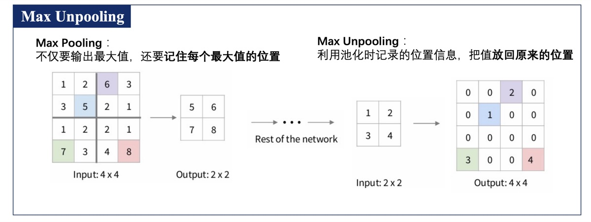
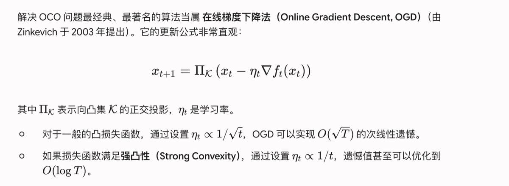

# 08 · 图像分割

## 任务对比

| 任务 | 粒度 | 输出 |
|------|------|------|
| 图像分类 | 整张图 | 一个类别标签 |
| 目标检测 | 物体级 | 边界框 + 类别 |
| 语义分割 | 像素级 | 每个像素一个类别标签 |
| 实例分割 | 像素级 | 每个像素一个类别 + 实例 ID |

> **密集预测**要求对每个像素都做出精确预测。

---

## 语义分割（Semantic Segmentation）

为图像中**每一个像素点**分配一个语义类别标签。

### 上采样方法

| 方法 | 说明 |
|------|------|
| 最近邻插值 | 直接复制最近像素值 |
| 零填充（反池化） | 填充 0 恢复分辨率 |
| 转置卷积 | 可学习的上采样 |
| 双线性插值 | 平滑的上采样 |

---

## 图像分割发展脉络

```
图像分类 → 目标检测 → 语义分割 → 实例分割
          (R-CNN 系列)   (FCN)      (Mask R-CNN)

---

## 课件截图

### DERT：CNN + Transformer



### 图像分割发展脉络


```
